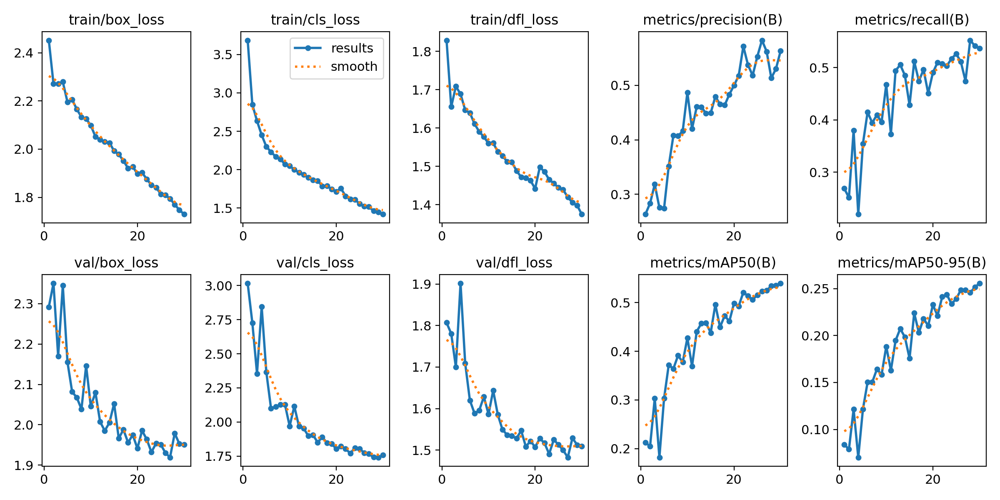
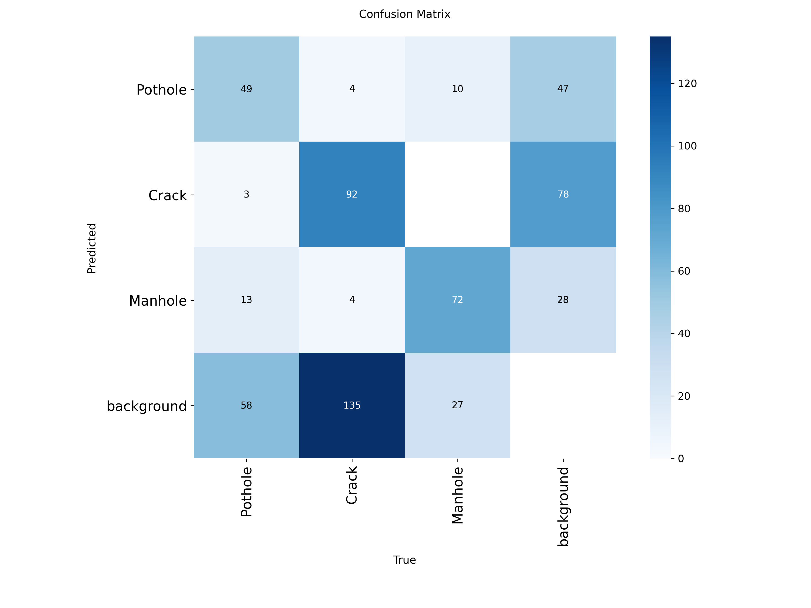
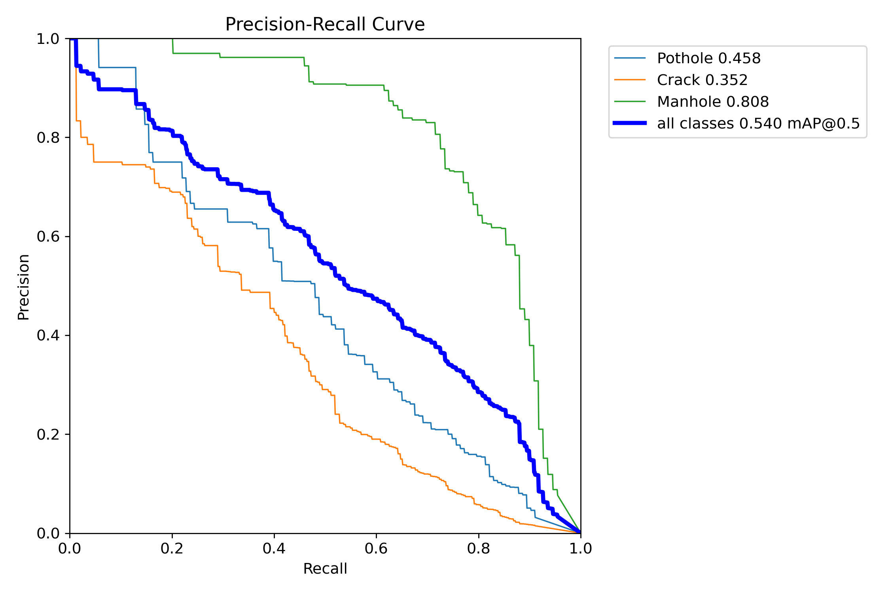
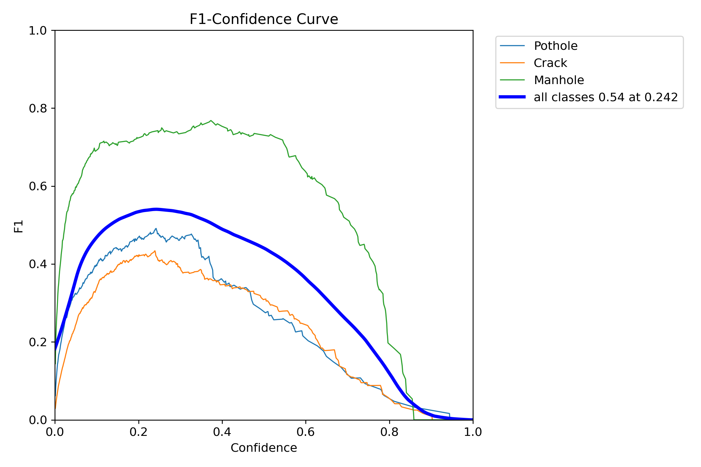

# Road Damage Detection with YOLOv8

## Overview
This project implements a road damage detection model using the YOLOv8 architecture to identify and classify road damages such as potholes, cracks, and manholes. The model is trained on the [Road Damage Dataset: Potholes, Cracks, and Manholes](https://www.kaggle.com/datasets/lorenzoarcioni/road-damage-dataset-potholes-cracks-and-manholes), which contains annotated images of road surfaces captured in various conditions.

## Dataset
The **Road Damage Dataset: Potholes, Cracks, and Manholes** from Kaggle is used for training and evaluation. Below are the detailed characteristics of the dataset:

- **Source**: [Road Damage Dataset: Potholes, Cracks, and Manholes](https://www.kaggle.com/datasets/lorenzoarcioni/road-damage-dataset-potholes-cracks-and-manholes) by Lorenzo Arcioni.
- **Content**:
  - **Images**: 2,009 images with annotated road damages captured in various environments.
  - **Annotations**: Provided in YOLO format (text files), including:
    - Filename of the image.
    - Bounding box coordinates (x_center, y_center, width, height, normalized) for road damages.
    - Class labels: `pothole`, `crack`, `manhole`.
  - **Classes**: The project focuses on three classes:
    - **Pothole**: Depressions in the road surface.
    - **Crack**: Surface cracks of varying types.
    - **Manhole**: Manhole covers on the road.
  - **Image Format**: JPEG files.
  - **Resolution**: Varies (typically 1280x720 or higher, resized to 640x640 for training).
  - **Conditions**: Images capture diverse conditions, including different lighting (day, dusk), weather (dry, wet), and road types (asphalt, concrete).
- **Size**: The dataset occupies approximately 1.2 GB when extracted.
- **Directory Structure**:
```
dataset/
├── images/
│   ├── train/
│   ├── val/
├── labels/
│   ├── train/
│   ├── val/
```
- **Usage**: The dataset is split into training and validation sets. Images are resized to 640x640 pixels to match YOLOv8 input requirements.

Download the dataset from [Kaggle](https://www.kaggle.com/datasets/lorenzoarcioni/road-damage-dataset-potholes-cracks-and-manholes) and extract it into the `dataset/` directory.

Install dependencies using:
```
pip install ultralytics
```

## Project Structure
```
road-damage-detection/
│
├── dataset/                  # Training and validation dataset
├── models/                   # Trained YOLO models and weights (last.pt, best.pt)
├── notebooks/                # Jupyter notebooks for training and evaluation
├── visuals/                  # Plots and detection examples
├── README.md                 # Project documentation
```

## Setup
1. **Clone the Repository**:
```
git clone https://github.com/3omd4/road-damage-detection.git
cd road-damage-detection
```

2. **Download the Dataset**:
   - Download the Road Damage Dataset from [Kaggle](https://www.kaggle.com/datasets/lorenzoarcioni/road-damage-dataset-potholes-cracks-and-manholes).
   - Extract the dataset into the `dataset/` directory.

## Usage
1. **Preprocess the Data**:
The dataset is provided in YOLO format with `images/` and `labels/` directories. Use the Jupyter notebook in the `notebooks/` directory to split the dataset into training and validation sets and start training, ensuring the `dataset/` directory is structured as outlined above and includes a `dataset.yaml` file specifying paths and classes.

3. **Train the Model**:
   Train the YOLOv8 model using this cell from script.ipynb file:
```
from ultralytics import YOLO

# Load a pretrained YOLOv8n model
model = YOLO("yolov8n.pt")

# Train
results = model.train(
    data=yaml_path,
    epochs=30,
    imgsz=640,
    project=MODEL_DIR,
    name="road_damage",
    plots=True
)```
   The script trains the YOLOv8n model, fine-tuning from `yolov8n.pt`, and saves the trained models (`last.pt` and `best.pt`) to the `models/` directory.

3. **Evaluate the Model**:
   Evaluate the model's performance on the validation set:
```
## Training Curves
The following plots illustrate the model’s performance during training (available in the `visuals/` directory):

- **Results Summary (metrics and losses over epochs)**  
  

- **Confusion Matrix**  
  

- **Precision-Recall Curve**  
  

- **F1-Score Curve**  
  

See the [visuals directory](https://github.com/3omd4/road-damage-detection/tree/main/visuals) for all plots and detection examples.
